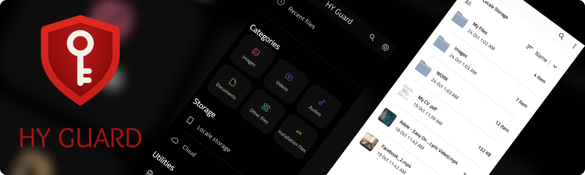
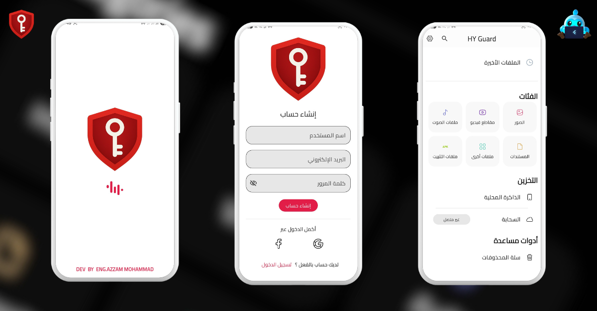
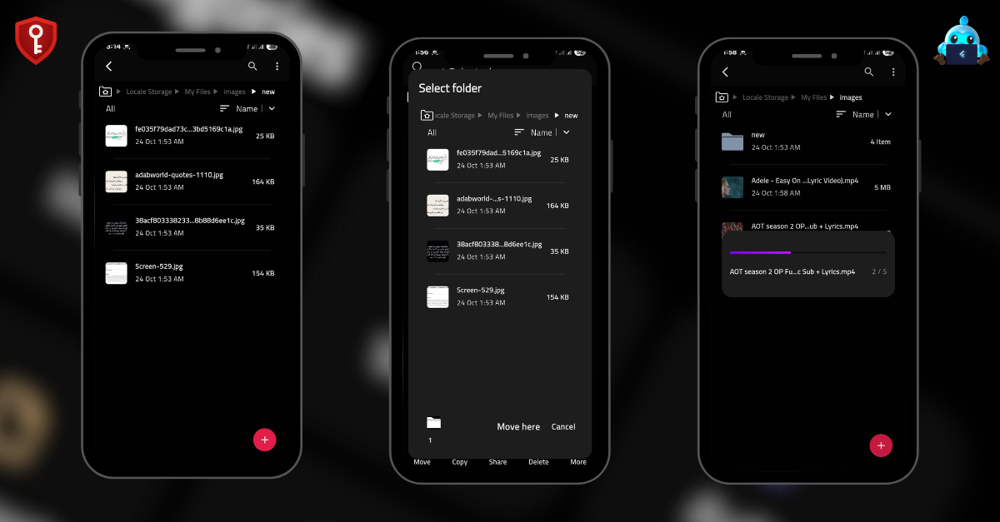
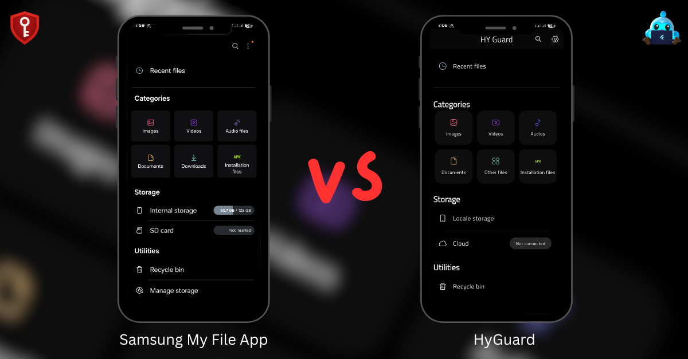
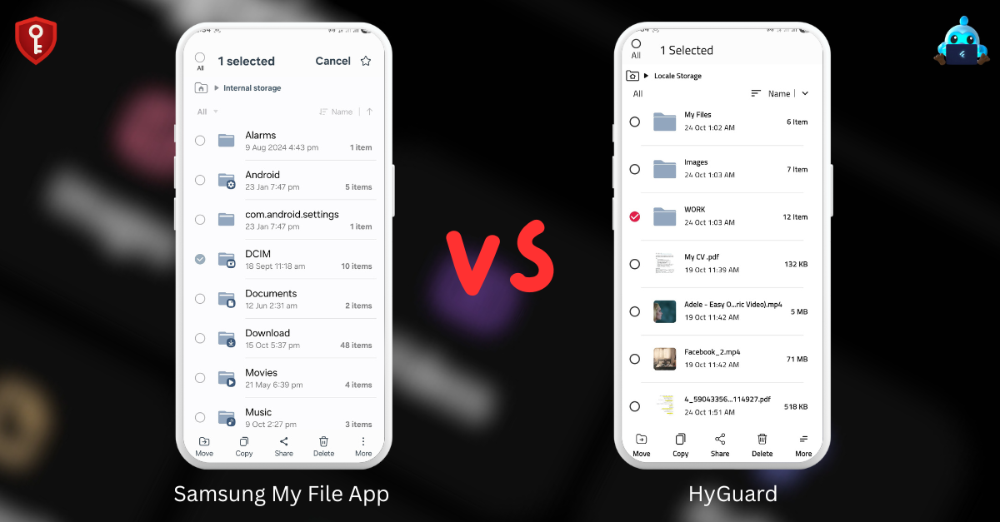
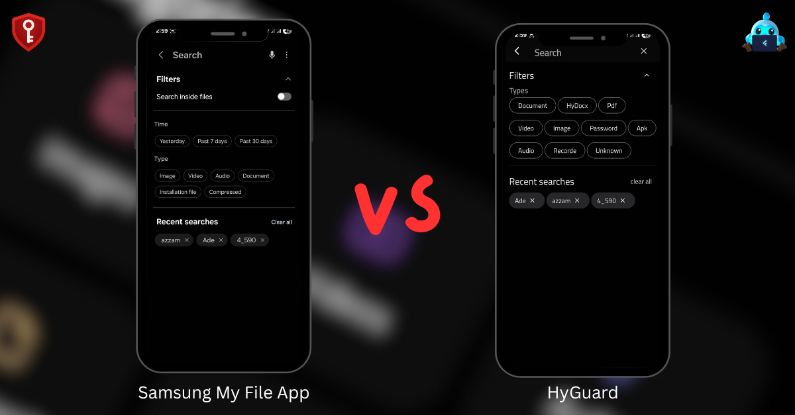

# 🔐 Hy Guard — Your Smart Secure Vault

Welcome to **Hy Guard** 🧭  
A modern Flutter-based application designed to securely store and organize your important files.  
It delivers a **premium user experience inspired by **Samsung File App**, with attention to every detail of **UI / UX**.

---

## 🎯 Purpose
**Hy Guard** provides a reliable and safe digital vault for your private data.  
It allows you to:
- Securely store and organize sensitive files.
- Remove them from device storage while keeping them accessible inside the app.  
- Manage files in a tree-structured, user-friendly interface similar to **Samsung File App** manager.

---

## 🌟 Key Features
✨ **User Login & Account Persistence**  
Firebase authentication ensures account security and future sync capabilities.

👥 **Guest Mode**  
Use the app without login for full privacy control.

📂 **Advanced File Management**  
- Create nested folders.  
- Move, copy, rename, or delete files easily.  
- Seamless user experience identical to professional file managers.

🔍 **Smart Search & Filtering**  
- Text-based search with history.  
- Filter by file type for faster access.  
- Quick access categories: Images, Videos, Documents, Audio, Installers.

🕒 **Recent Files Log**  
Quickly access your most recently opened files.

🎨 **Elegant UI & UX**  
- Supports **light / dark themes**.  
- Fully **bilingual (Arabic & English)**.  
- Built using **flex_color_scheme** for consistent, scalable theming.

---

## 📸 Screenshots

---

## 🧰 Tech Stack
| Technology | Purpose |
|-------------|----------|
| ⚙️ **Flutter** | UI and app development |
| 🔄 **Bloc** | State management |
| 🔐 **Firebase Auth** | Authentication & account handling |
| 🗄️ **Hive** | Local storage and offline file management |
| 🎨 **flex_color_scheme** | Theme and color management |

---

## 🚀 Future Roadmap
- ☁️ **Cloud integrations** (Google Drive, Firebase).  
- 🔄 **Cross-device sync & versioning**.  
- 🛡️ **Stronger security**: E2EE, biometric unlock.

---

## 📌 Project Links

- 🎬 Watch a short demo showcasing  [HY Guard Demo](https://youtu.be/OUJ6wYuagaY)
- 📱 Download and install the app  [HY Guard APK](https://drive.google.com/file/d/1zbd4FD2tRU5J_VZ24XNjn5mbrhT5UiiJ/view?usp=drive_link)

---

## 📫 Get in Touch

I’m happy to connect for questions, feedback, or collaboration opportunities:

- [LinkedIn](https://www.linkedin.com/in/azzam-mohammad-1359ab218/) 
- [Email](azzammo954@gmail.com)
- [profile](https://sites.google.com/view/eng-azzam-mohammad/about-me)

